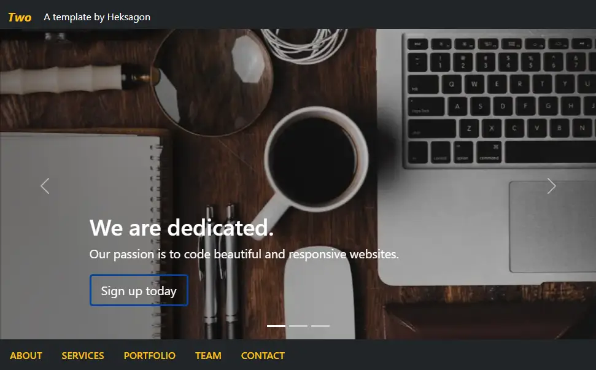
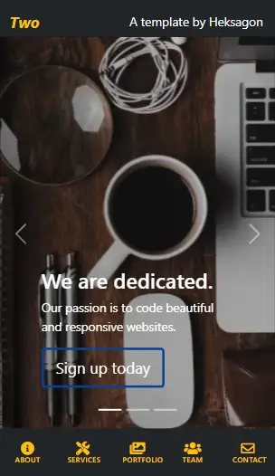

# Two 
```by Heksagon```
## Click here >> [Live Demo](https://heksagonnet.github.io/two/) 
## Click here >> [Direct Download](https://github.com/heksagonnet/two/archive/main.zip) 
🔧Easy-Installation ⚡️Fast 📱Responsive
---
## Summary
Two is a **beautiful, responsive, one-page portfolio website template** for creative individuals or businesses. All the colours, fonts, and images are **customizable** to your specifications. Using a [Bootstrap 5.0 Framework](https://getbootstrap.com/docs/5.0/getting-started/introduction/), it is **responsive** and looks good in various screen resolutions from mobile devices, tablets to desktops. 

---
## Preview
<p align="center">
  <kbd></kbd>
  <kbd></kbd>
</p>

---
## Performance (Lighthouse Report)

[Click here to check out the result]()

To keep it optimized, in the server that you choose to host, have a suitable caching policy and properly sized images.

---
## Support

If you like this template, please give a star, and consider supporting me at:

[](https://ko-fi.com/heksagon)

Your support is greatly appreciated 😊

---
